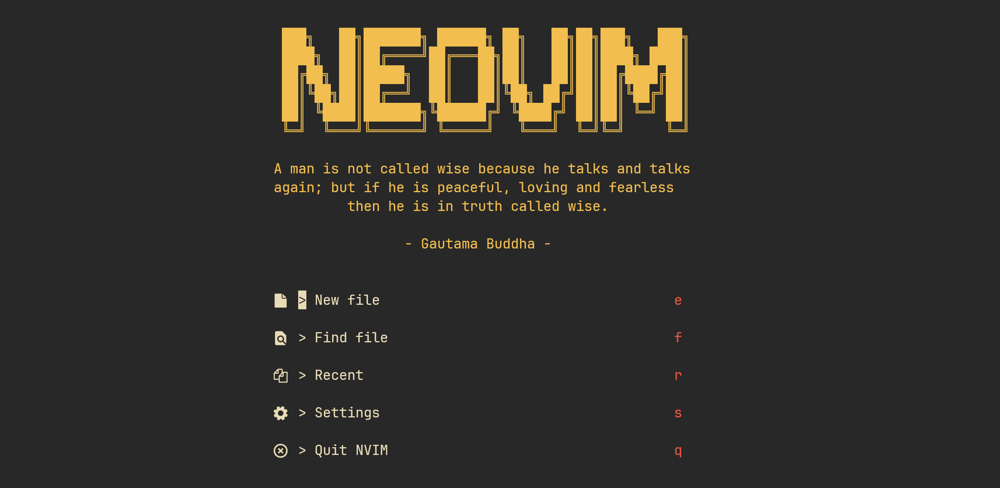

# inspire.nvim



A simple quote-of-the-day plugin for neovim.

## Installation

- Lazy.nvim

```lua
{
    "RileyGabrielson/inspire.nvim",
    config = function()
        require("inspire").setup({})
    end,
},
```

- Packer
```lua
use {
    "RileyGabrielson/inspire.nvim",
    config = function()
        require("inspire").setup({})
    end,
}
```

## Configuration

```lua
{
    -- 'daily' or 'random'
    mode = "daily",

    -- Array of custom quotes
    quotes = {
        {text = "My First Custom Quote", author = "Me"},
        {text = "My Second Custom Quote", author = "Myself"},
        {text = "My Third Custom Quote", author = "and I"},
    }
}
```

## Usage

To view today's quote in a new buffer, call
```lua
lua require('inspire').show_quote()
```

inspire.nvim is also compatible with any dashboard plugin. For example, to include the quote in [alpha-nvim](https://github.com/goolord/alpha-nvim) as seen in the example screenshot above:
```lua
{
	"goolord/alpha-nvim",
	dependencies = { "echasnovski/mini.icons", "RileyGabrielson/inspire.nvim" },
	config = function()
		local alpha = require("alpha")
		local dashboard = require("alpha.themes.dashboard")
		local inspire = require("inspire")

		local header = {
			"                                                     ",
			"  ███╗   ██╗███████╗ ██████╗ ██╗   ██╗██╗███╗   ███╗ ",
			"  ████╗  ██║██╔════╝██╔═══██╗██║   ██║██║████╗ ████║ ",
			"  ██╔██╗ ██║█████╗  ██║   ██║██║   ██║██║██╔████╔██║ ",
			"  ██║╚██╗██║██╔══╝  ██║   ██║╚██╗ ██╔╝██║██║╚██╔╝██║ ",
			"  ██║ ╚████║███████╗╚██████╔╝ ╚████╔╝ ██║██║ ╚═╝ ██║ ",
			"  ╚═╝  ╚═══╝╚══════╝ ╚═════╝   ╚═══╝  ╚═╝╚═╝     ╚═╝ ",
			"                                                     ",
		}
		local quote = inspire.get_quote()
		local centered_quote = inspire.center_text(quote.text, quote.author, 52, 8, 52)

		for _, line_text in pairs(centered_quote) do
			table.insert(header, line_text)
		end

		dashboard.section.header.val = header
		dashboard.section.buttons.val = {
			dashboard.button("e", "  > New file", ":ene <BAR> startinsert <CR>"),
			dashboard.button("f", "  > Find file", ":cd $HOME/Workspace | Telescope find_files<CR>"),
			dashboard.button("r", "  > Recent", ":Telescope oldfiles<CR>"),
			dashboard.button("s", "  > Settings", ":e $MYVIMRC | :cd %:p:h | split . | wincmd k | pwd<CR>"),
			dashboard.button("q", "  > Quit NVIM", ":qa<CR>"),
		}

		alpha.setup(dashboard.opts)
	end,
},
```
